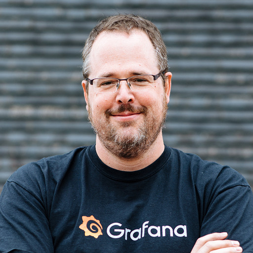

## Social links
* Twitter: @TwitchiH - [https://twitter.com/TwitchiH](https://twitter.com/TwitchiH)
* GitHub: @RichiH - [https://github.com/RichiH](https://github.com/RichiH)
* LinkedIn: [https://www.linkedin.com/in/richih](https://www.linkedin.com/in/richih)

## En
Richard "RichiH" Hartmann is the Director of Community at Grafana Labs, Prometheus team member, OpenMetrics founder, OpenTelemetry member, CNCF Technical Advisory Group Observability chair, CNCF Technical Oversight Committee member, CNCF Governing Board member, and more. He also leads or organizes various conferences, including PromCon, FOSDEM, DENOG, DebConf, and Chaos Communication Congress. In the past, he made mainframe databases work, ISP backbones run, freenode work, and designed and built a datacenter from scratch. Go through his talks at https://github.com/RichiH/talks or follow him on Twitter at https://twitter.com/TwitchiH for musings on the intersection of technology and society.

## De
Richard "RichiH" Hartmann Director of Community bei Grafana Labs. Er ist Mitglied von Prometheus, hat OpenMetrics gegründet, und Mitglied von OpenTelemetry. Er sitzt dem CNCF Technical Advisory Group Observability vor und sitzt im CNCF Technical Oversight Committee und CNCF Governing Board. Er organisiert und leitet verschieden Konferenzen, unter Anderem PromCon, FOSDEM, DENOG, DebConf, und Chaos Communication Congress. In seiner Vergangenheit hat er Großrechnerdatenbanken programmiert, Internet Backbones am Laufen gehalten, freenode geleitet, und ein komplettes Rechenzentrum von der Konzeptphase bis zur Abnahme verantwortet. Seine öffentlichen Vorträge, Podcasts, Interviews, etc sind unter https://github.com/RichiH/talks zu finden. Auf Twitter geht es https://twitter.com/TwitchiH hauptsächlich um die Schnittmenge von Gesellschaft und Technologie.

