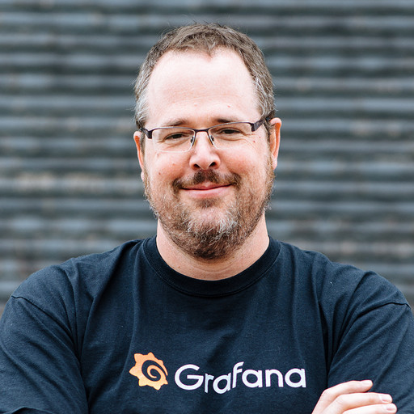

Richard "RichiH" Hartmann is the Director of Community at Grafana Labs, Prometheus team member, OpenMetrics founder, CNCF TAG Observability chair, and other things. He also leads or organizes various conferences, including PromCon, FOSDEM, DENOG, DebConf, and Chaos Communication Congress. In the past, he made mainframe databases work, ISP backbones run, and designed and built a datacenter from scratch. Go through his other talks at https://github.com/RichiH/talks or follow him on Twitter at https://twitter.com/TwitchiH for musings on the intersection of society and technology.

